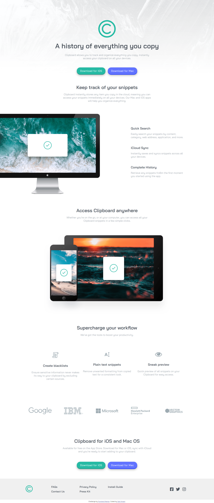

# Frontend Mentor - Clipboard landing page solution

This is a solution to the [Clipboard landing page challenge on Frontend Mentor](https://www.frontendmentor.io/challenges/clipboard-landing-page-5cc9bccd6c4c91111378ecb9). Frontend Mentor challenges help you improve your coding skills by building realistic projects.

## Table of contents

- [Overview](#overview)
  - [The challenge](#the-challenge)
  - [Screenshot](#screenshot)
  - [Links](#links)
- [My process](#my-process)
  - [Built with](#built-with)
  - [What I learned](#what-i-learned)
- [Author](#author)

## Overview

### The challenge

Users should be able to:

- View the optimal layout for the site depending on their device's screen size
- See hover states for all interactive elements on the page

### Screenshot



### Links

- Solution URL: [Github](https://github.com/zaidansari42/FEM-Clipboard-landing-page)
- Live Site URL: [Live Website](https://zaidansari42.github.io/FEM-Clipboard-landing-page/)

## My process

### Built with

- Semantic HTML5 markup
- CSS custom properties
- Flexbox
- CSS Grid

### What I learned

I learned how to create a beautiful website with only HTML & CSS. And how to move an image out of the container box and adjust items according to the width of the device it's been viewed on.

```html
<div class="intro">
  <h2>Access Clipboard anywhere</h2>
  <p>
    Whether you’re on the go, or at your computer, you can access all your
    Clipboard snippets in a few simple clicks.
  </p>
</div>
```

```css
@media screen and (max-width: 960px) {
  .device img,
  .pc img {
    width: 95%;
  }
}
```

## Author

- Website - [Add your name here](https://github.com/zaidansari42/)
- Frontend Mentor - [@zaidnasari42](https://www.frontendmentor.io/profile/zaidansari42)
- Twitter - [@zaidnasari42](https://www.twitter.com/zaidnasari42)
